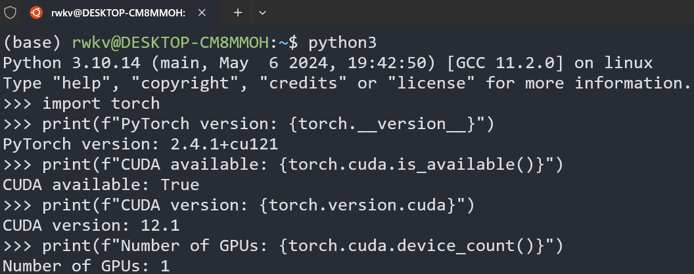
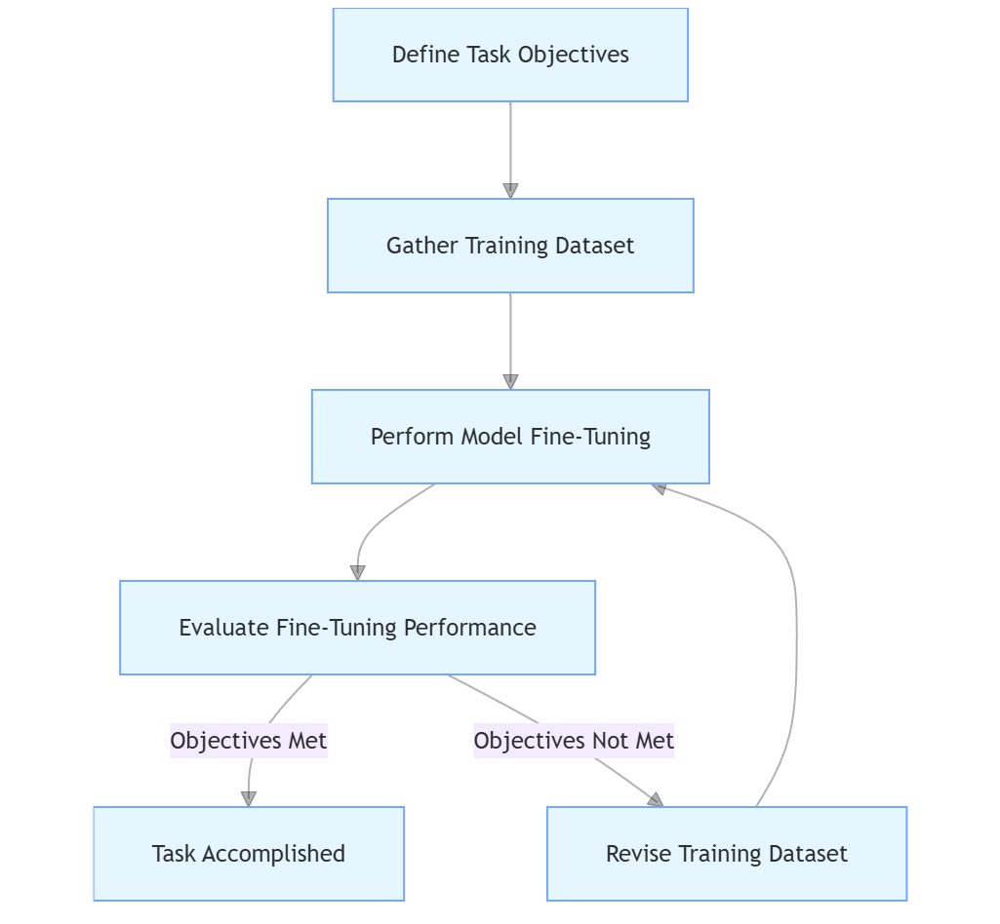
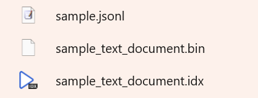

# Introduction to Fine-tuning

---
The RWKV fine-tuning documentation offers fine-tuning tutorials for RWKV, including LoRA, State tuning, Pissa, Lisa, etc. By fine-tuning the RWKV model, you can enhance the model's performance on specific tasks or enable the model to play a particular role.

Keywords: RWKV fine-tuning, rwkv fine-tuning tutorial, RWKV model fine-tuning, RWKV fine-tuning experiment, rwkv method

---

## Why Fine-tune the RWKV Model?

Currently, all the publicly released RWKV models are base models (also known as pre-trained models). These base models are trained on large-scale datasets in fields such as natural language processing and possess strong generalization ability and rich knowledge reserves.

However, to maintain generalization ability and universality, the RWKV base model is not optimized for a specific type of task. Therefore, the performance of the RWKV model on certain specific tasks may not be satisfactory.

Fine-tuning the RWKV model, simply put, means retraining the RWKV model using high-quality datasets from specific domains (such as law, literature, medicine, etc.) or tasks (such as material summarization, novel continuation, etc.). The fine-tuned RWKV model will exhibit higher-quality and more stable performance on the corresponding tasks.

Compared with training a brand-new model from scratch, fine-tuning only requires adjusting the parameters of the pre-trained model to achieve satisfactory task results, which requires fewer training cycles and less computing resources.

In summary, we can optimize the performance of the RWKV model on various tasks through fine-tuning, thereby quickly building application scenarios and implementing applications based on the RWKV model.

## What Do I Need to Prepare for Fine-tuning Training?

To fine-tune the RWKV model, you need to prepare **a Linux system** and basic knowledge of Linux, as well as a **high-performance NVIDIA graphics card**.

Secondly, you need to configure a **virtual environment and software packages** for training the RWKV model in the Linux system.

Finally, you need to prepare a **dataset** for fine-tuning training.

## What Models Can Be Fine-tuned with Consumer-grade Graphics Cards?

The following is a reference for fine-tuning models with consumer-grade graphics cards (4090 or lower):

| Model Size | Full-parameter Fine-tuning | LoRA/Pissa | QLoRA/QPissa | State Tuning |
| --------- | ---- | ---- | ---- | ---- |
| RWKV6-1.6B | Out of video memory | 7.4GB GPU | 5.6GB GPU | 6.4GB GPU |
| RWKV6-3B | Out of video memory | 12.1GB GPU | 8.2GB GPU | 9.4GB GPU |
| RWKV6-7B | Out of video memory | 23.7GB GPU (out of video memory at batch size 8) | 14.9GB GPU (19.5GB required at batch size 8) | 18.1GB GPU |

As you can see, consumer-grade graphics cards cannot perform full-parameter fine-tuning of RWKV-V6. Even for the smallest RWKV6-1.6B model, full-parameter fine-tuning requires an A100 or more powerful GPU.

However, with 24GB of video memory, you can try full-parameter fine-tuning of [RWKV-V5 0.4B](https://huggingface.co/BlinkDL/rwkv-5-world/blob/main/RWKV-5-World-0.4B-v2-20231113-ctx4096.pth) to run the RWKV training process locally.

## Fine-tuning Environment Configuration

---
The RWKV fine-tuning documentation provides fine-tuning tutorials for RWKV, such as LoRA, State tuning, Pissa, and Lisa. By fine-tuning the RWKV model, you can enhance the model's performance on specific tasks or make the model play a specific role.

keywords: RWKV fine-tuning environment, rwkv fine-tuning code, RWKV fine-tuning steps, rwkv configuration of fine-tuning environment

---

To train the RWKV model, please first follow the steps below to configure the training environment for your Linux system.

### Configure the Conda Virtual Environment

The default virtual environment for fine-tuning the RWKV model is Conda. Here, we take MiniConda as an example to introduce how to configure the Conda environment on a Linux system.

In your Linux or WSL workspace, run the following commands in sequence:

```bash copy
# Download the latest MiniConda installation package
wget https://repo.anaconda.com/miniconda/Miniconda3-latest-Linux-x86_64.sh
# Run the installation script of the MiniConda installation package. Pay attention to the progress during the installation and enter "yes" in time!
sh Miniconda3-latest-Linux-x86_64.sh -u
# Restart the environment variables and activate the Conda environment
source ~/.bashrc
```

At this point, we are in the default `base` environment of Conda. To avoid software version conflicts, we need to create and activate a new Conda environment named `rwkv`. Run the following commands in sequence:

```bash copy
# Create a Conda environment named rwkv and specify the Python version as 3.10
conda create -n rwkv python=3.10
# Activate the rwkv environment
conda activate rwkv
```


So far, we have configured the Conda environment required for RWKV fine-tuning.

### Install the Software Required for Training

To achieve the **best training performance** of the RWKV model, it is recommended to install the following software:

- torch 2.1.2+cu121 (or the latest version of torch)
- The latest deepspeed
- pytorch-lightning ==1.9.5

Run the following commands in sequence in the Conda environment of the terminal to install the RWKV training environment:

```bash copy
# Install the CUDA 12.1 version of torch by specifying the URL
pip install torch --upgrade --extra-index-url https://download.pytorch.org/whl/cu121
# Specify to install the 1.9.5 version of PyTorch Lightning and other commonly used machine learning toolkits
# The --upgrade parameter means that if the corresponding software package is already installed in the environment, it will be upgraded to the latest version
pip install pytorch-lightning==1.9.5 deepspeed wandb ninja --upgrade
# The following are some other toolkits that will be used when fine-tuning with RWKV-PEFT. It is recommended to install them in advance
pip install bitsandbytes einops triton rwkv-fla rwkv transformers GPUtil plotly gradio datasets
```

::: tip
The recommended software versions are the best practices for RWKV training. You can also choose to install other versions of the software as long as compatibility is ensured.
:::

### Check the CUDA Environment

After the above dependencies are installed, you should have installed the latest version of Torch and the CUDA 12.1 toolkit at the same time.

Run the following commands in sequence to check the PyTorch version and whether the CUDA tool is available:

```python
python3 # Start python3

import torch # Import the torch package

# Print the PyTorch version
print(f"PyTorch version: {torch.__version__}") 
# Check if CUDA is available
print(f"CUDA available: {torch.cuda.is_available()}")
# Print the CUDA version
print(f"CUDA version: {torch.version.cuda}")
# Print the number of available GPUs
print(f"Number of GPUs: {torch.cuda.device_count()}")
```

If the command `print(f"CUDA available: {torch.cuda.is_available()}")` returns `CUDA available: True`, it proves that the CUDA environment is available:



If it returns `False`, use the command `print(f"CUDA version: {torch.version.cuda}")` to check if the CUDA version of torch is correctly installed.

If the CUDA version of torch is installed and it still returns `CUDA available: True`, you may need to reinstall the CUDA environment (it is recommended to use CUDA 12.1 or a later version). For the installation steps, please refer to the [**CUDA Toolkit Installation Documentation**](https://developer.nvidia.com/cuda-downloads).

## Preparing Fine-tuning Data

---
The RWKV fine-tuning documentation provides fine-tuning tutorials for RWKV, such as LoRA, State tuning, Pissa, Lisa, etc. By fine-tuning the RWKV model, you can enhance the model's performance on specific tasks or make the model play a specific role.

keywords: rwkv fine-tuning data, RWKV fine-tuning corpus, RWKV dataset, rwkv training data, rwkv fine-tuning corpus format

Follow the steps below to organize your training dataset.

---

### Organizing jsonl Data

First, confirm **what knowledge you want the RWKV model to learn**. This knowledge can be materials from a certain field, such as legal Q&A, financial knowledge, etc.; or it can be texts for a certain type of task, such as material summarization, role-playing, etc.

In short, you need to collect the corresponding data according to the specific task requirements and organize it into a file in the `jsonl` format.

The following is a reference for the `jsonl` format for different content types/task types:

#### Single-round Question and Answer

Single-round question and answer is usually used to train downstream tasks such as chatbots. The data format is:

``` jsonl copy
{"text": "User: Question\n\nAssistant: Answer"}
```

An example of a single-round question and answer:

``` jsonl copy filename="single-qa.jsonl"
{"text": "User: What is water?\n\nAssistant: Water is a colorless, odorless, and tasteless liquid, and it is one of the most common substances on Earth."}
```

In this example, the content after `User:` is usually the input given to the model by humans, and the content after `Assistant:` is the answer given by the model.

::: tip
In addition to `User` and `Assistant`, you can also add the `System` role to provide background settings or strengthen the model's recognition of the `Assistant:` role.
:::

``` jsonl copy filename="qa-with-system.jsonl"
{"text": "System: You are an excellent tour guide proficient in the history and geography of Guangdong.\n\nUser: Tour guide, what is the capital city of Guangdong?\n\nAssistant: The capital city of Guangdong is Guangzhou, which has a very long history."}
{"text": "System: It is the period of the Three Kingdoms, and the world is in chaos with many warlords vying for power. You are a soldier fighting against Zhang Fei.\n\nUser: Boy, take this sword from Zhang Fei!\n\nAssistant: Please spare my life, Brother Zhang Fei!"}
```

The `System` role is also applicable to the multi-round conversation data below.

#### Multi-round Conversation

Multi-round conversation data is suitable for task scenarios of continuous conversation and context understanding, such as **customer service robots** and **role-playing**.

The format of multi-round conversation data is:

``` jsonl copy
{"text": "User: Question 1\n\nAssistant: Answer 1\n\nUser: Question 2\n\nAssistant: Answer 2"}
```

An example of a multi-round conversation:

``` jsonl copy filename="multi-qa.jsonl"
{"text": "User: Good evening!\nNice to meet you!\n\nAssistant: Good evening!\nNice to meet you too!\n\nUser: I'm ten years old this year.\nHow old are you?\n\nAssistant: I'm five years old this year."}
```

::: tip
Note that `User:` and `Assistant:` need to be separated by `\n\n`. But line breaks within the conversation content can only be represented by `\n`.
:::

#### Instruction-based Question and Answer

Instruction-based question and answer data is suitable for summarization tasks such as **information extraction**, **material summarization**, and **meeting minutes**, and it is also the recommended format for instruction tuning.

``` jsonl copy
{"text": "Instruction: Instruction\n\nInput: Content\n\nResponse: Answer"}
```

Among them, `Instruction` is the instruction given to the model, `Input` is the content input given to the model, and `Response` is the answer given by the model.

::: tip
Note: An English space should be inserted between `Instruction:`, `Input:`, `Response:` and the text content.

In addition, `Instruction:`, `Input:`, and `Response:` need to be separated by `\n\n`. But line breaks within the conversation content can only be represented by `\n`.
:::

An example of an instruction-based question and answer:

``` jsonl copy filename="instruction-qa.jsonl"
{ "text": "Instruction: Please determine which category the following sentence belongs to. The categories include culture, entertainment, sports, finance, real estate, automobiles, education, technology, military, tourism, international affairs, securities, agriculture, e-sports, and people's livelihood. Please directly output the category without any additional content.\n\nInput: The RWKV large model officially launched the seventh-generation architecture RWKV-7.\n\nResponse: Technology"}
```

The content of `Instruction:` and `Input:` will be concatenated and used as the input to the model, and the content of `Response:` is the answer given by the model.

In this example, the model will receive the following input:

``` text copy
Please determine which category the following sentence belongs to. The categories include culture, entertainment, sports, finance, real estate, automobiles, education, technology, military, tourism, international affairs, securities, agriculture, e-sports, and people's livelihood. Please directly output the category without any additional content.
The RWKV large model officially launched the seventh-generation architecture RWKV-7.
```

The model will give the following output:

``` text copy
Technology
```

#### Long Text Data such as Articles/Novels

Long text data such as articles and novels is usually used to train continuous long text generation tasks such as **text continuation** and **text expansion**.

For long text content such as whole novels and extremely long articles, the data format is:

``` jsonl copy
{"text": "Turn the content of each article into one line of JSONL, even if it is a novel with one million words."} 
```

For short content with titles such as news and announcements, the data format is:

``` jsonl copy 
{"text": "《Title》\nBody content"}
```

For the task of **continuing a single paragraph** of a novel or article, the data format is:

``` jsonl copy
{"text": "User: The beginning of a paragraph of about 100 words\n\nAssistant: The subsequent text of the paragraph"}
```

For the task of expanding a novel paragraph from a novel outline, the data format is:

``` jsonl copy
{"text": "User: The outline of the chapter\n\nAssistant: The complete content of the chapter"}
```

### More Details of the Training Data

#### How Much Data is Needed for Fine-tuning

There is no strict specification for the quantity of fine-tuning training data. It can be several hundred pieces, several thousand pieces, or even more.

Generally, **the more data there is, the better the effect of fine-tuning training will be**. But high-quality data requires a large amount of time and human resources. Therefore, it needs to be adjusted according to the actual situation:

- Adjust according to the complexity of the fine-tuning task: For simple classification or summarization tasks, maybe only a few hundred pieces of data are needed. For complex role-playing or text generation tasks, several thousand pieces or more of data are required.
- Quality is more important than quantity: High-quality data should accurately reflect the characteristics of the target task and cover diverse scenarios and expressions.

The adjustment of training data is a step-by-step iterative process, which usually needs to go through the following steps:



Until a satisfactory fine-tuning effect is obtained.

#### Duplicating and Randomly Sorting the Data

When the training data is insufficient, duplicating the training data helps to enhance the model's understanding and memory of specific knowledge, and shuffling the data order is to reduce the risk of overfitting.

On Linux or Mac systems, use the following commands to repeat and shuffle the data file:

``` bash copy
# Repeat the data.jsonl file three times and output all lines to the repeated-data.jsonl file
# This command can also be used to merge multiple jsonl data files
awk 'NR > 1 && NF == 0 {next} {print}' data.jsonl data.jsonl data.jsonl > repeated-data.jsonl
# Shuffle the lines of the repeated-data.jsonl file and output the shuffled result to the shuffled-data.jsonl file
shuf repeated-data.jsonl > shuffled-data.jsonl
```

::: tip
`data.jsonl` needs to be replaced with the name of the jsonl data file you have prepared.
:::

::: tip
On Windows systems, you can use [WSL](https://docs.microsoft.com/zh-cn/windows/wsl/install) (Windows Subsystem for Linux) or install the [Cygwin](https://www.cygwin.com/) tool to use the `awk` and `shuf` commands.
:::

#### Adding Conventional Data

It is recommended to add some conventional data to the fine-tuning dataset. Adding conventional data helps to enhance the model's generalization ability and reduce the risk of overfitting at the same time.

Suppose we are fine-tuning a model for answering elementary math problems, and the data samples are similar to this:

``` jsonl copy
{"text": "User: 1 + 1 = ?\n\nAssistant: 2"}
{"text": "User: 1 + 2 = ?\n\nAssistant: 3"}
{"text": "User: 1 + 3 = ?\n\nAssistant: 4"}
```

At this time, we can add some other expressions of math problems and conventional conversation data in non-math fields to the dataset, such as:

``` jsonl copy
{"text": "User: 1 + 1 = ?\n\nAssistant: 2"}
{"text": "User: I have 5 apples and give 2 to Xiaoming. How many are left?\n\nAssistant: 3 apples"}
{"text": "User: What is the sum of 8 and 7?\n\nAssistant: 15"}
{"text": "User: The area of a rectangle is 20 square meters and the width is 4 meters. So what is its length?\n\nAssistant: The length is 5 meters."}
{"text": "User: What's the weather like today?\n\nAssistant: It's sunny today, and it's suitable for going out and having fun."}
{"text": "User: 1 + 2 = ?\n\nAssistant: 3"}
```

### Converting jsonl Files to binidx Files

After obtaining the training data in the `jsonl` format, we need to use the [json2binidx](https://github.com/Abel2076/json2binidx_tool) tool to convert the `jsonl` file into a `binidx` file that is more suitable for RWKV training.

<Steps>

### Downloading the json2binidx Tool

Clone the repository

``` bash copy
git clone https://github.com/Abel2076/json2binidx_tool.git
```

Or directly [download the compressed package](https://github.com/Abel2076/json2binidx_tool/archive/refs/heads/main.zip) and unzip it.

After getting the `json2binidx` folder, use the `cd json2binidx_tool` command to enter the `json2binidx_tool` directory.

### Converting jsonl Files to binidx Files

Place the prepared `jsonl` dataset file in the `json2binidx/data` folder.

Run the following command in the `json2binidx_tool` directory to convert the `jsonl` file in the `data` folder into a `binidx` file:

``` bash copy
python3 tools/preprocess_data.py --input ./data/sample.jsonl --output-prefix ./data/sample --vocab ./rwkv_vocab_v20230424.txt --dataset-impl mmap --tokenizer-type RWKVTokenizer --append-eod
```

There are two parameters that need to be modified in this command:

``` bash copy
--input ./data/sample.jsonl # The path to the input jsonl file, which needs to be replaced with the name of the jsonl file you have prepared
--output-prefix ./data/sample # The path to the output bin/idx file, which needs to be replaced with the file name you want
```

</Steps>

The following prompt means that the conversion is complete:


You should be able to find the converted bin/idx files in the `data` folder:



At this time, our preparatory work is over. Next, we need to **select a fine-tuning method** and read the corresponding documentation. 